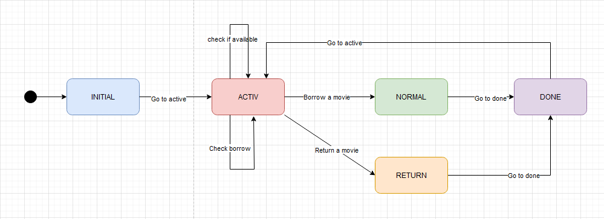

# De ce generare automată de teste?

A crea manual teste pentru un produs software este un proces predispus la erori de natură umană și necesită foarte mult timp. În plus, este destul de ușor ca anumite cazuri particulare să fie omise, astfel este greu de asigurat că implementarea este complet riguroasă.

Generarea automată de teste poate combate aceste probleme. O metodă este generarea de teste bazată pe modele care descriu comportamentul programului, metodă care se numește și „model-based testing” (MBT). Pentru a descrie acest comportament ne putem folosi de niște automate mai speciale, și anume „Stream-X Machines” (SXMs). Aceste SXMs extind automatele finite prin adăugarea unui tuplu de memorie și funcții în locul unei simple tranziții.

JSXM este un tool care, odată ce primește o specificație de SXM descrisă în XML, poate genera automat teste în limbajul Java.

# Despre SXM

SXM este un model bazat pe stări care poate descrie comportamentul unui sistem. În loc de simple tranziții, un SXM are funcții care primesc un input și o memorie (care este un set posibil infinit), și produc un output și memoria care poate fi schimbată. Putem considera un exemplu în care definim un SXM care descrie comportamentul unei platforme de împrumutat/cumpărat filme:



# Despre SXM

În exemplul arătat anterior avem o platformă în care se pot împrumuta filme. Inițial platforma este inactivă și trebuie deschisă („Go to active”). De acolo avem mai multe opțiuni:

- Putem verifica dacă un film este deja împrumutat cuiva („Check if available”)
- Putem verifica dacă un user a împrumutat deja un film („Check borrow”, un user poate avea maxim un împrumut activ)
- Putem împrumuta un film („Borrow a movie”)
- Putem returna un film („Return a movie”)

Pentru simplitate am ales să omitem stările de eroare pentru fiecare stare în parte (de exemplu împrumutul unui film deja împrumutat altcuiva), ceea ce înseamnă că SXM-ul nostru _nu_ este complet definit.

# Memoria SXM-ului dat ca exemplu

Memoria în exemplul nostru este reprezentată de:

- Un set de tupluri `(int, Movie)` care reprezintă „baza de date” a filmelor (id + metadata)
- Un set de tupluri `(int, Borrower)` care reprezintă „baza de date” a userilor (id + metadata)

Mai concret, `Movie` și `Borrower` sunt clase definite în Java, iar memoria în sine este formată din `Map<Integer, Movie>` și `Map<Integer, Borrower>`.

# Specificația XML

Clasele menționate anterior sunt acompaniate de specificații XML care descriu tranzițiile. Ca exemplu, putem lua specificația pentru `Movies`:
```xml
<states>
	<state name="available"/>
	<state name="borrowed"/>
</states>

<initialState state="available"/>

<transitions>
	<transition from="available" function="setBorrowedPF" to="borrowed"/>
	<transition from="borrowed" function="releasePF" to="available"/>
	<transition from="available" function="movieIsAvailablePF" to="available"/>
	<transition from="borrowed" function="movieIsNotAvailablePF" to="borrowed"/>
</transitions>
```

După cum se poate observa, tranzițiile sunt specificate la nivel înalt, mai jos definim și implementările pentru funcții.

# Specificația XML

Luăm ca exemplu funcțiile `canBorrowMoviePF` și `canNotBorrowMoviePF`:

```xml
<function name="canBorrowMoviePF" input="canBorrow" output="canBorrowOut" xsi:type="OutputFunction">
	<effect>
		canBorrowOut.result = true;
	</effect>
</function>
		
<function name="canNotBorrowMoviePF" input="canBorrow" output="canBorrowOut" xsi:type="OutputFunction">
	<effect>
		canBorrowOut.result = false;
	</effect>
</function>
```

Care nu fac altceva decât seteze un membru la `true`/`false`. Similar sunt definite specificațiile pentru `Movie`, `Store` și restul funcționalităților din `Borrower`, adaptate pentru cerințele fiecăreia.

# Generarea de teste

Putem defini și niște generatoare de input-uri pentru a permite tool-ului JSXM să ne genereze teste automat. Exemplu pentru `Borrower`:

```xml
<testinputgeneration>
	<inputgenerator function="borrowMoviePF"> 
		setArg(0, "newsxm:availableMovie");
	</inputgenerator>
	<inputgenerator function="borrowMovieNotAvailablePF"> 
		setArg(0, "newsxm:borrowedMovie"); 
	</inputgenerator>
	<inputgenerator function="borrowMovieCannotBorrowPF"> 
		setArg(0, "newsxm:availableMovie"); 
	</inputgenerator>
</testinputgeneration>
```

# Exemple de teste generate

```java
@Test
public void test_k2_3_borrowMoviePF_borrowMoviePF_borrowMovieNotAvailablePF() {
    StoreAdapter obj = new StoreAdapter();
    assertEquals("borrowMovieOut", obj.borrowMovie(51, 11));
    assertEquals("borrowMovieOut", obj.borrowMovie(52, 12));
    assertEquals("borrowMovie_NotAvailable", obj.borrowMovie(53, 11));
}
```

Acest test este generat pentru `Store`. În particular se asigură de faptul că un user nu poate lua un film care este deja împrumutat altcuiva.

# Exemple de teste generate

Alt test, generat tot pentru `Store`:

```java
@Test
public void test_k2_12_borrowMoviePF_borrowMovieCannotBorrowPF_borrowMovieNotAvailablePF() {
    StoreAdapter obj = new StoreAdapter();
    assertEquals("borrowMovieOut", obj.borrowMovie(51, 11));
    assertEquals("borrowMovie_CannotBorrow", obj.borrowMovie(51, 12));
    assertEquals("borrowMovie_NotAvailable", obj.borrowMovie(52, 11));
}
```

Acesta se asigură de faptul că un user nu poate avea mai mult de un film și că filmul împrumutat nu poate fi împrumutat altcuiva. Practic se asigură că cererea de împrumut pentru un user care are deja un film nu va rezulta în înlocuirea filmului cu cel cerut în caz că este disponibil.

Evident, testele sunt în număr mult mai mare (de ordinul zecilor pentru fiecare componentă), am prezentat doar câteva cazuri particulare din ele.
