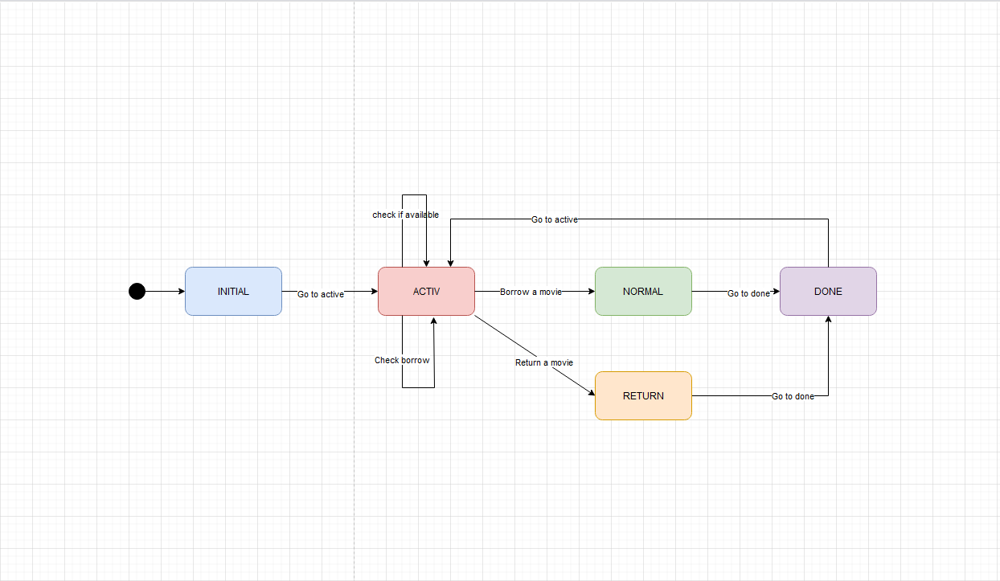

# De ce generare automată de teste?

A crea manual teste pentru un produs software este un proces predispus la erori de natură umană și necesită foarte mult timp. În plus, este destul de ușor ca anumite cazuri particulare să fie omise, astfel este greu de asigurat că implementarea este complet riguroasă.

Generarea automată de teste poate combate aceste probleme. O metodă este generarea de teste bazată pe modele care descriu comportamentul programului, metodă care se numește și „model-based testing” (MBT). Pentru a descrie acest comportament ne putem folosi de niște automate mai speciale, și anume „Stream-X Machines” (SXMs). Aceste SXMs extind automatele finite prin adăugarea unui tuplu de memorie și funcții în locul unei simple tranziții.

JSXM este un tool care, odată ce primește o specificație de SXM descrisă în XML, poate genera automat teste în limbajul Java.

# Despre SXM

SXM este un model bazat pe stări care poate descrie comportamentul unui sistem. În loc de simple tranziții, un SXM are funcții care primesc un input și o memorie (care este un set posibil infinit), și produc un output și memoria care poate fi schimbată. Putem considera un exemplu în care definim un SXM care descrie comportamentul unei platforme de împrumutat/cumpărat cărți:

